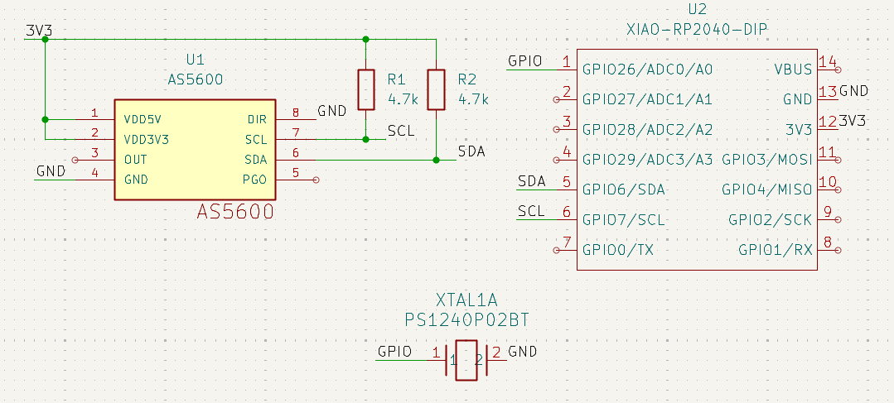
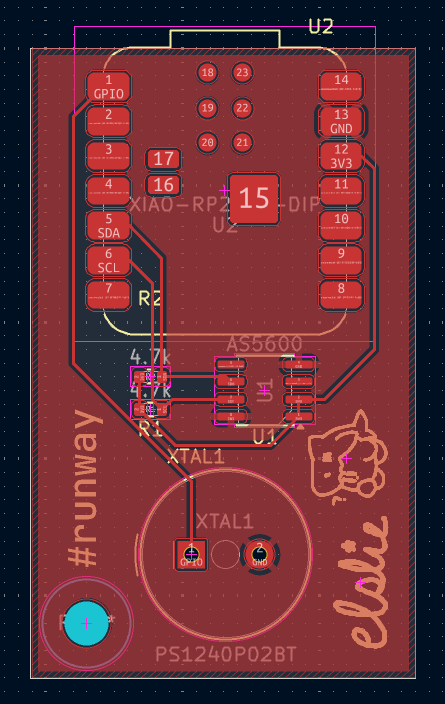

# \#runtime - a PCB that converts rotational position into frequency

# Components

For my input, I rolled the AS5600, which gives the exact rotational position of the PCB.
For my output, I rolled a Passive piezo buzzer, which buzzes when you run a signal through it.
For my connector, I rolled a Carabiner, which is added on through the hole in the PCB.
I chose to use the Seeed Studio XIAO RP2040 for my microcontroller because it was beginner friendly and easy to use.

# Function

When powered, the PCB will buzz from the buzzer, and based on the rotational position read by the AS5600, the buzzer will buzz at a different frequency.

# Screenshots

Schematic:

PCB:

# Bill of Materials

| Part                          | Qty | Source          | Total Cost $USD |
|-------------------------------|-----|-----------------|-----------------|
| XIAO RP2040                   | 1   | Seeed Studio    | $3.90           |
| AS5600 Magnetic angle sensor  | 1   | JLCPCB catalog  | $1.41           |
| 4.7k resistor                 | 2   | JLCPCB catalog  | $0.02           |
| Passive piezo buzzer          | 1   | JLCPCB catalog  | $0.22           |
| Total Cost                    | n/a | n/a             | $5.55           |
