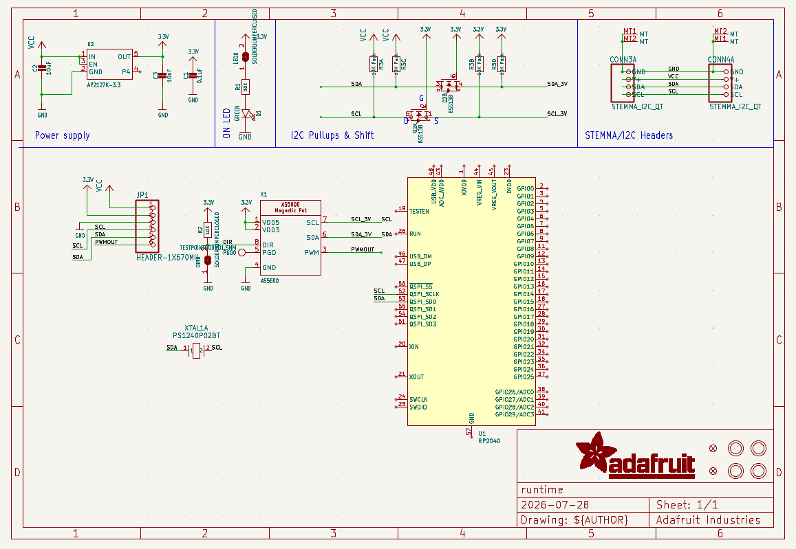
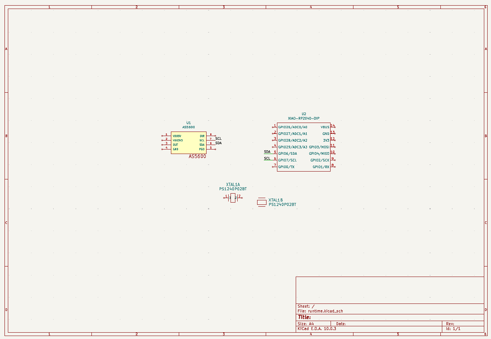
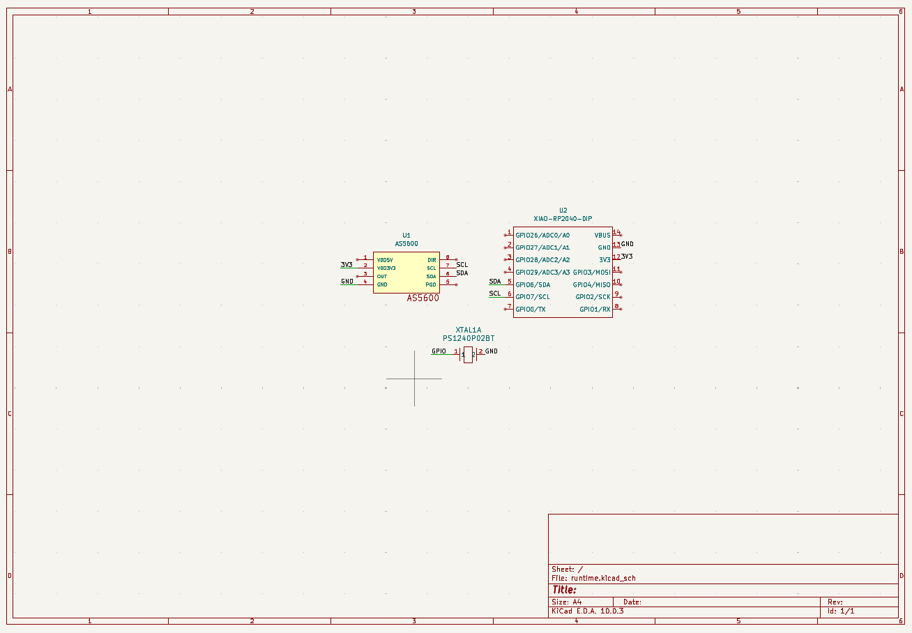
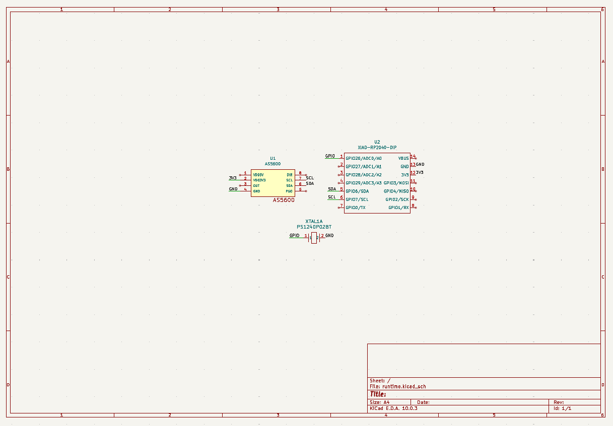
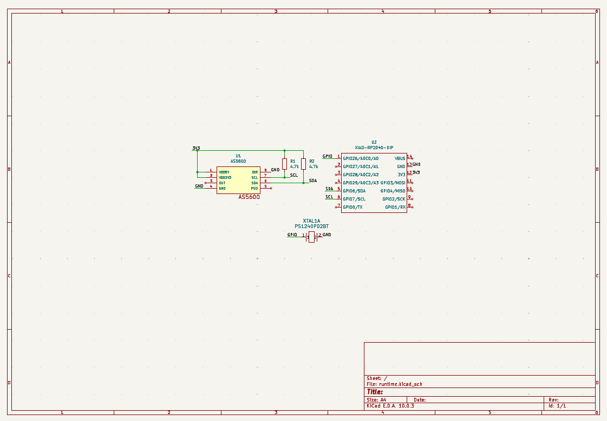
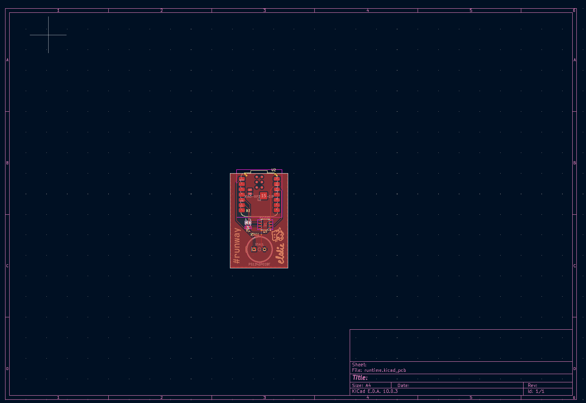
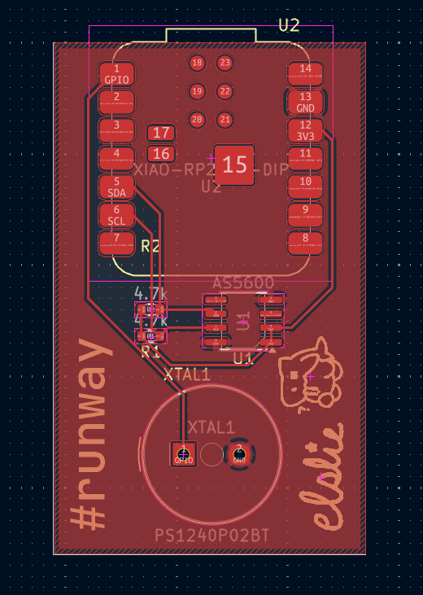

NOTE: all of my lapses are named runtime#, where # is the session number

# July 28: the struggles of a kicad noob - 1 hr 17 secs (lapse)
I read through the runway guide to help me out for this project.
Reading through the second step, I learned about the different components of a PCB (input, output, connector), and also how to do research (datasheets) and get useful files (symbols for schematics, and footprints for PCBs) for each part.

After reading through, I downloaded the symbols (.kicad_sch) for each component and imported it into a kicad schematic file.
Unfortunately, I couldn't find one for the AS5600, so I just imported a .sch and hoped it worked.

After importing everything, I wired the SDA and SCL parts together using labels. They look different than the ones shown in the guide, but it should be fine. However, I couldn't find any pinout diagrams for the buzzer (PS1240P02BT) so I just guessed where they might go.

This is the schematic I have so far:

It looks very complicated and I have no idea what I'm looking at. 

# July 30: remaking the whole schematic - 41 mins 57 secs (lapse)
Looking through the datasheets for each component, I realized that I made the whole schematic incorrectly. 
My schematic looks a lot more complicated than the pinout diagrams for the datasheets.

So, I did some googling and found the correct schematics for the microcontroller (RP2040-**DIP**) and the rotation-input component (found an actual .kicad_sch instead of .sch).
However, I still don't know what the "1" and "2" mean for the buzzer, and since there are no pinout diagrams or explanations on the datasheet, I have no idea what to do with it. 
Additionally, there's an "A" piece and a "B" piece, and they're different, so I'm also confused about that.

Here is the new schematic:

It's a lot more simpler and makes more sense to me.

# August 3: fixing up the schematic - 11 mins (lapse)
I got ChatGPT to help me figure out what wires with what, because I actually have no idea how. 
Apparently you have to wire **everything** that matches, including the 3V3 and GND. 
I also learned what links to the buzzer through help on Slack (thx Meghana ur goated), which was a GPIO and GND. 

Then I posted an image of my current schematic on Slack so it could be reviewed by someone who knows what they're doing, and it looks good to them, I'll be moving on to designing the PCB (i think)!!!

This is my current schematic:

# August 4: fixed the GPIO issue and asked for help again - 12 mins (lapse)
I forgot to add the GPIO label to the microcontroller so I added that.

Since Meghana asked me to check whether I needed to connect the OUT from the AS5600, I did, and learned that if I'm using I2C, I don't need to use the OUT.

After seeing some other schematics in #runtime, I noticed that their GND is connected to a downwards-facing triangle, and now I'm wondering if I needed to do that as well.

So, I put these things in a message and sent it to #runtime to get more feedback and to get my GND question answered.

This is my schematic right now:

# August 6: finished schematic, worked on pcb awaiting review - 2 hrs 37 mins 7 secs (lapse)
(wait its due in 4 days uh oh i need to lock in)
Meghana reviewed my schematic that I ended up with yesterday and told me to check if my components have internal pullups, and if not, I would need to add 4.7k resistors to my circuit.

Going through the AS5600 datasheet, I found the sample circuit diagram and was really confused about it. 
So (of course) I asked Meghana and she helped me understand what everything meant. 
Because in the diagram, there were external pullups (resistors outside of the actual chip), and I realized that it was just basically telling me what to do. 
So I just copied the diagram, and after approval from Meghana, I moved on to working on the PCB.

Here is the final(?) schematic:

I worked quite a bit on my PCB today. 
Reading through the guide, I learned how to make it.

However, apparently the footprints are really important to the PCB (the actual things you put on the PCB), so I had to go and assign them because I didn't do that properly.
I thought that when it was highlighted yellow, that it was just a warning, but apparently not.
I struggled to assign the footprints because I didn't know which footprint is which, so through trial and error and research, I was able to find the right footprints.

After that came the wiring. 
It was extremely overwhelming at first because of all of the overlapping blue lines everywhere, but by taking things one wire at a time, I was able to completely.
But, I didn't like how the shape looked, so I adjusted the positions and shape of the whole thing.

Then, I posted it in Slack for some feedback, but I guess I didn't read the tutorial thoroughly enough because there were a lot of things that could be improved upon.

So, I rewired everything, added a ground pour, and also added images and text to the silkscreen.

Here is my current PCB:

# August 7: fixed issues with the pcb based on feedback - 21 mins (lapse)
I was told that I don't need to connect the GND pins, which makes sense because the pour's net is GND, which basically means that anything connected to that pour is automatically GND. 
However, after removing the wires, Meghana noticed that the GND pin for the microcontroller, and neither of us knew what was the issue, so I did some searching online. 
I figured out that the issue was that the zone clearance was too high (the space between the pour and the pins), so it didn't connect to the microcontroller pin. 
After lowering the clearance, the pin was successfully connected to the pour.
I sent a picture in #runtime to recieve feedback on the PCB.

Here is the current PCB:
